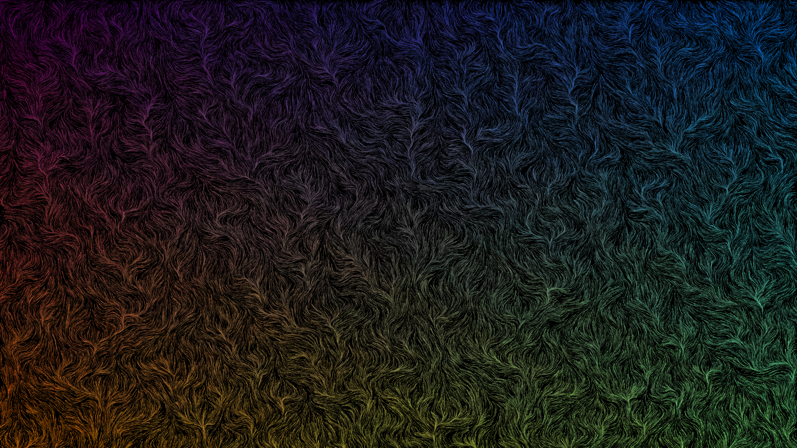

# FlowField

A grid of vectors is generated (via perlin noise) and a number of points are
place and moved according to the nearest vector.

By changing the parameters of the field and simulation, the outcome can vary
drastically.

